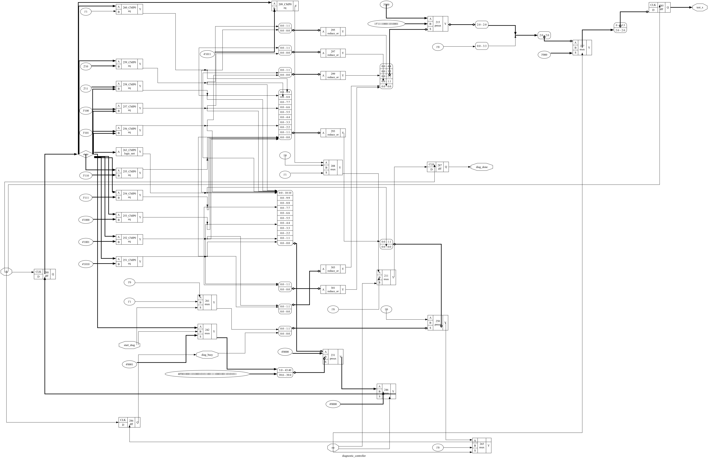
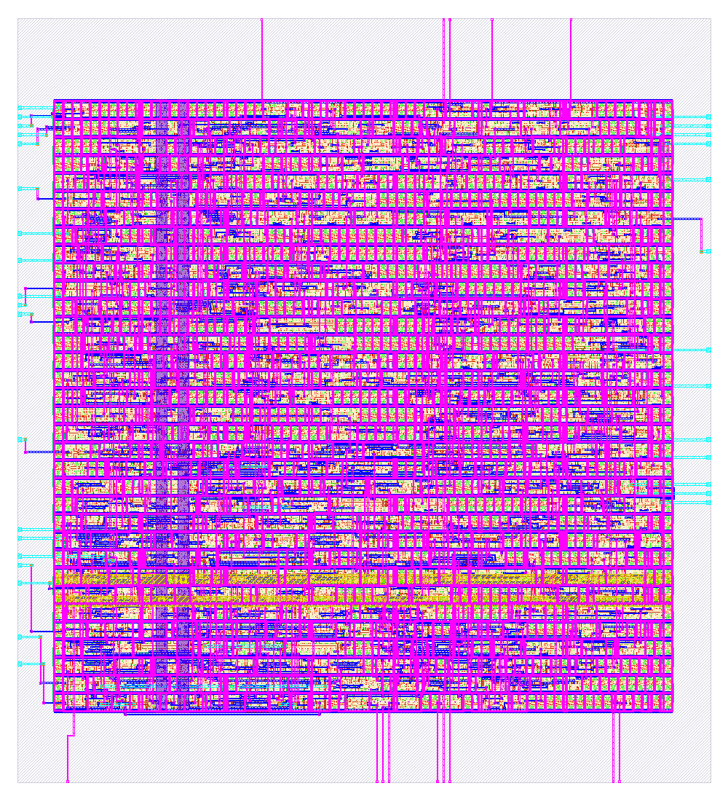

# Self-Diagnosing 4-Tap FIR Filter with Automated Fault Detection & Localization

[](https://en.wikipedia.org/wiki/Verilog)
[](http://iverilog.icarus.com/)
[](https://github.com/librelane/librelane)
[](https://github.com/google/skywater-pdk)

## 📌 Overview

This project implements a **Self-Diagnosing 4-Tap Finite Impulse Response (FIR) Filter** in Verilog HDL, fully integrated with an automated ASIC physical design flow targeting the SkyWater 130nm (`sky130`) process node.

Digital signal processing (DSP) filters operating in high-reliability environments (e.g., aerospace, automotive, medical, and edge-computing devices) require runtime fault isolation to prevent catastrophic system failures. This architecture embeds real-time diagnostic hardware into a 4-tap FIR filter pipeline:
1. **Normal Filtering Mode**: Computes 4-tap weighted sum outputs ($y[n] = \sum_{k=0}^{3} h[k] \cdot x[n-k]$).
2. **Automated Diagnostic Mode**: An integrated **Diagnostic Controller** injects deterministic test vectors into partial product multipliers and compares computed MAC outputs against Golden Hardware Signatures to isolate structural faults.
3. **Pinpoint Localization**: Identifies the exact faulty multiplier tap index (`0`-`3`) and pinpoints the specific stuck-at bit location.

---

## 🛠 Project Architecture

```
                       +----------------------------------+
                       |     Self-Diagnosing FIR Top      |
                       |      (self_diagnosing_fir)       |
                       +----------------------------------+
                                        |
         +------------------------------+------------------------------+
         |                              |                              |
         v                              v                              v
+------------------+          +-------------------+          +------------------+
| Diagnostic       |          | Fault Injection   |          | FIR Core &       |
| Controller FSM   |--------->| Module            |--------->| Diagnostic Engine|
| (test vectors)   |          | (fault_injection) |          | (fir_diagnostic) |
+------------------+          +-------------------+          +------------------+
```

### Module Breakdown

| Module | Location | Description |
| :--- | :--- | :--- |
| **`fir`** | [`rtl/fir.v`](file:///Users/balliprincephilomon/Prince/Self_diagnosis_FIR/rtl/fir.v) | Baseline 4-Tap FIR filter core with internal 4-stage shift registers (`x0`..`x3`) and tap multipliers (`p0`..`p3`). |
| **`fault_injection`** | [`rtl/fault_injection.v`](file:///Users/balliprincephilomon/Prince/Self_diagnosis_FIR/rtl/fault_injection.v) | Hardware test harness for injecting stuck-at-0, stuck-at-1, or bit-flip faults into tap multiplier outputs during diagnostic testing. |
| **`fir_diagnostic`** | [`rtl/fir_diagnostic.v`](file:///Users/balliprincephilomon/Prince/Self_diagnosis_FIR/rtl/fir_diagnostic.v) | Compares tap partial products against golden signature expectations to detect anomalies. |
| **`diagnostic_controller`** | [`rtl/diagnostic_controller.v`](file:///Users/balliprincephilomon/Prince/Self_diagnosis_FIR/rtl/diagnostic_controller.v) | Finite State Machine (FSM) controlling diagnostic sequences, test vector timing, and flag assertions (`diag_busy`, `diag_done`). |
| **`self_diagnosing_fir`** | [`rtl/self_diagnosing_fir.v`](file:///Users/balliprincephilomon/Prince/Self_diagnosis_FIR/rtl/self_diagnosing_fir.v) | Top-level module integrating the FIR filter, diagnostic controller, fault injection, and status outputs (`fault_detected`, `fault_location`, `fault_bit`). |

---

## 💻 Simulation & Verification

Simulation and testbenches are executed using **Icarus Verilog (`iverilog`)** and **`vvp`**.

### 1. Healthy FIR Filter Verification
Verify the standard 4-tap FIR filter response with zero faults:
```bash
iverilog -o healthy_output rtl/fir.v tb/healthy_output_tb.v
vvp healthy_output
```

### 2. Fault Injection Testbench
Inject faults into multiplier taps and verify error flag generation:
```bash
iverilog -o faulty_test faults/fir_faulty.v rtl/fir_diagnostic.v tb/fir_tb.v
vvp faulty_test
```

### 3. Complete Self-Diagnosis Verification (Top-Level)
Run full end-to-end self-testing with automated fault localization:
```bash
iverilog -o final_test rtl/fir.v rtl/fir_diagnostic.v rtl/diagnostic_controller.v rtl/self_diagnosing_fir.v tb/self_diagnosing_fault_tb.v
vvp final_test
```

### 4. Waveform Viewing (VCD)
Generated VCD trace files are stored in `simulation/`:
- `simulation/complete_self_diagnosis.vcd`
- `simulation/bit_fault.vcd`
- `simulation/fir.vcd`

To view waveforms using GTKWave:
```bash
gtkwave simulation/complete_self_diagnosis.vcd
```

---

## 🎨 Physical Design & ASIC Flow (Synthesis, Cadence Innovus / PnR & GDSII)

The physical implementation of `self_diagnosing_fir` follows a full ASIC implementation flow utilizing **Cadence Genus** for RTL logic synthesis and **Cadence Innovus / LibreLane (OpenLane 2)** for physical placement, routing, STA, and sign-off GDSII generation on the **SkyWater 130nm PDK** (`sky130_fd_sc_hd`).

### 1. Gate-Level Logic Synthesis Schematic (Cadence Genus / RTL Synthesis)
Logic elaboration, gate mapping, and timing optimization are driven by [`genus/synth.tcl`](file:///Users/balliprincephilomon/Prince/Self_diagnosis_FIR/genus/synth.tcl). Below is the structural logic synthesis schematic diagram for the top-level self-diagnosing FIR macro:



### 2. Cadence Innovus / Physical Design & Layout Screenshot
The physical floorplanning, placement, clock tree synthesis (CTS), and routing results are saved at [`final_results/self_diagnosing_fir.png`](file:///Users/balliprincephilomon/Prince/Self_diagnosis_FIR/final_results/self_diagnosing_fir.png):



### Key ASIC Implementation Metrics

Summary of synthesis, timing, power, and physical verification metrics ([`final_results/metrics.csv`](file:///Users/balliprincephilomon/Prince/Self_diagnosis_FIR/final_results/metrics.csv)):

| Metric | Value | Unit / Status |
| :--- | :--- | :--- |
| **Technology Node** | SkyWater 130nm (`sky130_fd_sc_hd`) | Commercial / Open PDK |
| **Top Module** | `self_diagnosing_fir` | Top ASIC Macro |
| **Standard Cell Count** | **1,578** cells | - |
| **Total Standard Cell Area** | **8,678.32** $\mu m^2$ | - |
| **Target Clock Period** | **10.0** ns (100 MHz) | Met |
| **Total Power Consumption** | **0.599** mW ($599.38\ \mu W$) | Met |
| **Setup Slack (Nominal TT 25°C 1.8V)** | **+1.398** ns (Setup WNS: `0.0`) | Pass |
| **Hold Slack (Nominal TT 25°C 1.8V)** | **+0.314** ns (Hold WNS: `0.0`) | Pass |
| **Setup / Hold Violations** | **0** | Clean |
| **LVS (Layout vs Schematic)** | **0 Errors** (`design__lvs_error__count: 0`) | Clean |
| **DRC (Design Rule Check)** | **0 Errors** (`magic__drc_error__count: 0`) | Clean |
| **Antenna / Overlap Violations** | **0** | Clean |

---

## 📂 Repository Structure

```
.
├── README.md                     # Comprehensive Project Documentation
├── rtl/                          # Verilog RTL Source Code
│   ├── fir.v                     # Baseline 4-tap FIR filter
│   ├── self_diagnosing_fir.v     # Top-level self-diagnosing FIR macro
│   ├── diagnostic_controller.v   # FSM controller for diagnostic vectors
│   ├── fir_diagnostic.v          # Diagnostic comparison unit
│   └── fault_injection.v         # Hardware fault injection module
├── tb/                           # Simulation Testbenches
│   ├── healthy_output_tb.v       # Testbench for healthy baseline filter
│   ├── self_diagnosing_fault_tb.v# End-to-end self-diagnosis testbench
│   ├── bit_fault_tb.v            # Bit-level fault injection testbench
│   ├── fir_tb.v                  # FIR tap simulation testbench
│   └── diagnostic_controller_tb.v# FSM state machine testbench
├── faults/                       # Fault injection definitions
│   └── fir_faulty.v              # Fault model parameters
├── simulation/                   # VCD waveform traces & test executables
│   ├── complete_self_diagnosis.vcd
│   ├── bit_fault.vcd
│   └── fir.vcd
├── genus/                        # Cadence Genus Synthesis Scripts & Schematics
│   ├── synth.tcl                 # Cadence Genus TCL synthesis script
│   ├── schematic_neat.png        # Elaboration & gate-level synthesis schematic image
│   └── schematic.dot             # Graphviz DOT schematic representation
├── physical_design/              # OpenLane / Cadence Innovus & LibreLane Flow Scripts
│   ├── config.yaml               # Flow configuration parameters
│   └── runs/                     # EDA synthesis and PnR run artifacts
└── final_results/                # Final Tapeout & Sign-off Artifacts
    ├── self_diagnosing_fir.gds   # GDSII binary layout stream file
    ├── self_diagnosing_fir.png   # High-resolution PnR layout screenshot
    ├── metrics.csv               # Complete PnR, STA, Power & LVS metrics
    ├── config.yaml               # Signed-off configuration
    └── verification/             # Sign-off Verilog netlists
```

---

## 📜 License

Distributed under the MIT License. See `LICENSE` for details.
